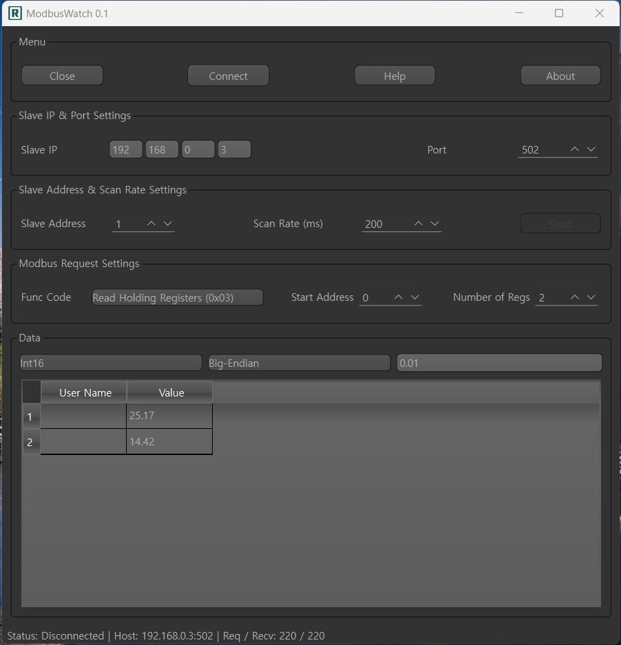
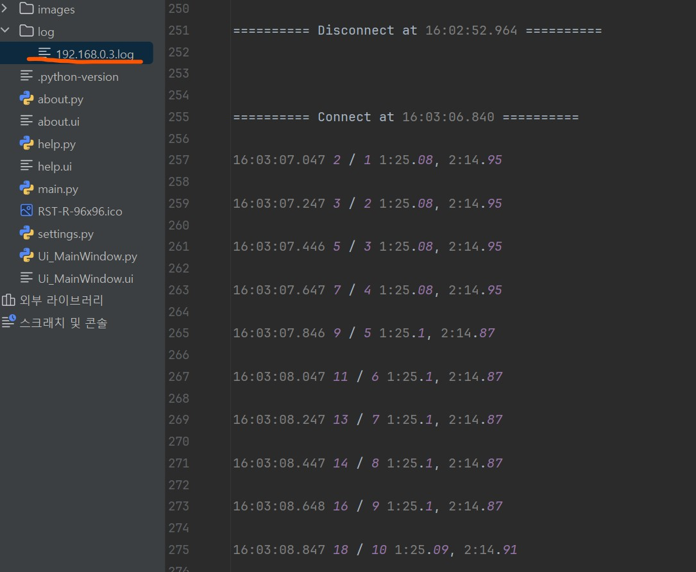
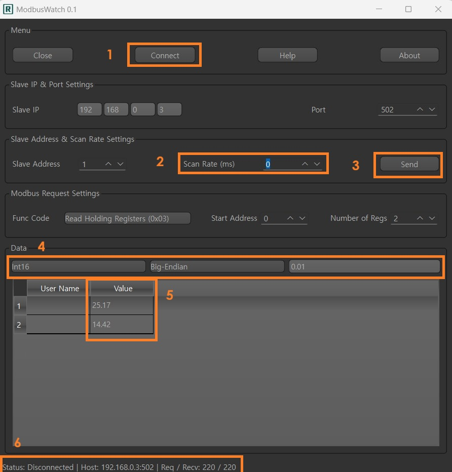
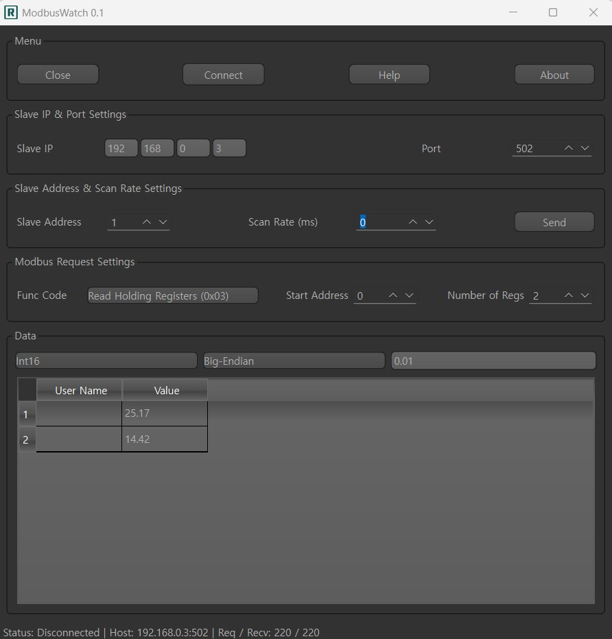

# Modbus Watch

It's a simple GUI for Modbus TCP master (client) which is working on a PC. I have wanted to test [my custom board](https://github.com/jnlee4838/esp32-ksz8863-dual-Ethernet) which supports Modbus TCP slave (server) with daisy chain Ethernet. and there was a famous commercial grade tooL, "Modebus Poll". I have tried to use it several times. but, whenever I executed this tool, it alerts "how many days left for free usage"... and then, it finally stops as there is a time limit....
  
I have decided to make a simple tool for Modbus TCP master with "QT for Python" and Pyside6 as well as pyModbus TCP library.

~~Some functions (methods) have not been implemented. for an example, writing command linking with GUI from tableWidget and diplaying tableWidget on params etc. but, it works nice and gives you full log file as well. and also you can add the remain functions with ease.~~

As of Mar. 17, 2026: I have modified source and it working nice...but, I couldn't check everything. please let me know if any bugs or errors. I have tested it on Windows 11 on Python 3.12 as well as Pyside6. you can port it on different os with ease.

## Screenshots





## Preparation

* Python 3.12.10

* PyCharm or VS Code

* PySide6

* pyinstaller

* pyModbusTCP

## Compile

```bash

pyinstaller --noconsole -F --icon="RST-R-96x96.ico" --add-data "RST-R-96x96.ico;." main.py

```

the above command will make it a single executable file with icon. if you want to add your logo, please replace "RST-R-96x96.ico" to your one.

## How to use

   

1. set the params about Modbus TCP slave (server)...ip, port, slave address

2. The "Scan Rate" is very sensitive. so I made it "editFinished" connect/slot. so if you change the value, you should press "Enter" or your mouse should be pointed another. usually it is recommended to set over "200 ms"

   

3. The "Send Button" will be ~~get alive~~ activated in case that you set the "Scan Rate" to "0", which means you should click the "Send Button" to ~~ask~~ excute.

4. you can change "byte-order", "byte-type" as well as "scale" (raw value *= scale). the scale is working in the range 0 << xxx << 1.

5. ~~the tableWidget is not complete. you can add and modify at your end.~~ the tableWidget has been modified a lot. it's working on int32, uint32 as well as float32.

6. the "Status Bar" will show necessary information such as "connection", "Host info", "req_cnt/recv_cnt".

7. if you change some params once connected, it will be disconnected automatically.

## Related

It's a simple demonstation of ESP32 + KSZ8863 + Modbus TCP Slave (TCP Server) + SHT40.

[ESP32 + KSZ8863RLL + SH4x Modbus TCP Slave Demo](https://github.com/jnlee4838/ss_modbus_tcp_sht4x/readme)
